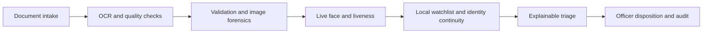

# DRISHTI

**Explainable AI-assisted identity and travel-document screening for border checkpoints.**

Built by **Unpaid Interns** for **Smart India Hackathon 2026**.

[Quick start](#quick-start) · [How it works](#screening-pipeline) ·
[API guide](docs/fastapi_backend.md) · [Security](docs/security_controls.md) ·
[Demo runbook](docs/sih_demo_runbook.md)

> Research and demonstration prototype. Recommendations assist a trained
> officer; they are not proof of fraud or an autonomous legal decision.

Drishti combines document classification, OCR, standards validation, image
forensics, live face verification, liveness, watchlist checks, duplicate
identity search, and crossing-history continuity into one evidence-backed
triage recommendation. It then tells the authorized officer what to verify
next and records the human disposition.

## Why this is different

- **Identity continuity, not just face matching:** the same biometric identity
  can be linked across renewed documents and previous crossings while
  conflicting biographic profiles are escalated.
- **Uncertainty-aware workflow:** bad capture quality produces corrective
  recapture guidance; it is not mislabeled as fraud.
- **Evidence before confidence:** visible-zone fields are checked against the
  MRZ, MRZ check digits are validated, and every adverse signal is inspectable.
- **Honest authenticity assurance:** cryptographic issuer proof, internal MRZ
  consistency, and visual-only screening are shown as different assurance
  levels.
- **Human accountability:** automated output is a triage recommendation. The
  officer's clear, refer, or deny disposition and reason are separately audited.

## Implemented document coverage

| Credential | Extraction and validation | Strongest available trust evidence |
|---|---|---|
| Aadhaar | Front OCR, visible-photo comparison, and signed back-QR cross-check | UIDAI Secure QR signature and signed portrait |
| Passport | Visible fields, TD3 MRZ, check digits, cross-zone comparison | MRZ consistency; e-passport chip reader remains an integration point |
| Visa | Number, type, entries, validity, stay, and optional holder fields | Visible-zone screening and local watchlist; external issuer integration pending |
| National ID | Common labelled fields with per-field provenance | Visible-zone screening; issuer adapter required in production |
| Driving licence | Identity, validity, classes, authority, and optional blood group | Visible-zone screening; issuer adapter required in production |
| Permit | Holder, permit type, validity, and authority | Visible-zone screening; immigration adapter required in production |

Country-specific templates can be layered over the conservative generic
extractor. Unknown credentials fail closed instead of being guessed as a
passport.

## Screening pipeline



1. Secure document capture and quality assessment
2. Document classification and OCR extraction
3. MRZ/field/date/expiry, visible-photo, and cross-source validation
4. ELA, noise, metadata, geometry, exposure, and contrast signals
5. Multi-frame face comparison and randomized liveness challenge
6. Watchlist and duplicate-identity screening
7. Cross-check against prior documents and border crossings
8. Explainable risk triage and adaptive secondary-inspection action
9. Recorded officer disposition and audit trail

## Quick start

### Requirements

- Python 3.11 (the tested development version)
- A webcam for live verification
- Initial network access to provision OCR models; pre-provision those models
  before an offline demonstration
- The included YuNet and SFace ONNX model files under `models/`

### Local development (Windows PowerShell)

```powershell
git clone https://github.com/UnpaidInterns67/drishti.git
cd drishti
py -3.11 -m venv venv
.\venv\Scripts\python.exe -m pip install -r requirements-dev.txt
$env:BOOTSTRAP_OFFICER_USERNAME = "admin"
$env:BOOTSTRAP_OFFICER_PASSWORD = Read-Host "Choose a unique password (at least 14 characters)"
$env:AUTH_COOKIE_SECURE = "false"
.\venv\Scripts\python.exe -m uvicorn backend.main:app --host 127.0.0.1 --port 8000
```

Open [the local console](http://127.0.0.1:8000/). Camera access works on localhost. See
[the SIH demo runbook](docs/sih_demo_runbook.md) before presenting.

On Linux/macOS, create the environment with `python3.11 -m venv venv`, use
`venv/bin/python`, and set the same variables with your shell's `export` command.

### Docker

Copy `.env.example` to `.env`, set a unique bootstrap password, and run:

```sh
docker compose up --build -d
```

The local demo uses HTTP on localhost. Remote camera use requires HTTPS;
see the [production deployment guide](docs/fastapi_backend.md#container-deployment).
Never commit the actual `.env` file.

## Testing

Run the application and security tests:

```powershell
.\venv\Scripts\python.exe -m pytest -q
.\venv\Scripts\python.exe scripts/security_check.py
```

Tests use synthetic data and mocks. The optional local document-specimen test
is skipped when its private fixture is absent. Passing tests demonstrate
regression coverage, not measured real-world biometric or forgery-detection
accuracy.

## Repository structure

```text
ai/              OCR interpretation, validation, forensics, biometrics, risk
backend/         FastAPI, officer authentication, sessions, SQLite persistence
web/             Browser-based officer console
models/          Local YuNet and SFace model weights
certs/           Public issuer trust certificates (not private signing keys)
tests/           Synthetic unit and integration tests
scripts/         Repository security checks
docs/            Integration contracts, security guidance, demo preparation
```

## Privacy and safe demonstrations

- Real identity documents, OCR dumps, database files, face embeddings, local
  credentials, and generated presentations are excluded from this repository.
- Use synthetic or explicitly authorized test material. Do not attach personal
  documents or biometric data to GitHub issues or pull requests.
- Keep runtime storage private, apply a retention policy, and use approved
  encryption and access controls before any real deployment.
- The public certificates in `certs/` verify signatures; they cannot sign new
  identity data. Their provenance and rotation caveats are documented there.

## Technology

Python · FastAPI · SQLite · RapidOCR/EasyOCR · OpenCV YuNet/SFace ·
MediaPipe · ONNX Runtime · HTML/CSS/JavaScript

## Contributing

Open an issue describing the intended change, work on a focused branch, and
submit a pull request with tests. Report suspected credential leaks privately
to the repository maintainers rather than posting secret values publicly.
Review third-party code and model licensing before redistributing or deploying.

## Important boundaries

Drishti is a decision-support prototype, not a legal determination that a
person or document is fraudulent. Image forensics are heuristic. Passport-chip,
INTERPOL, immigration, and issuing-authority checks require authorized hardware,
certificates, networks, and agreements. The interface reports those checks as
not performed rather than simulating a successful government response.

Security and production-deployment requirements are documented in
[security controls](docs/security_controls.md) and the
[backend guide](docs/fastapi_backend.md).
